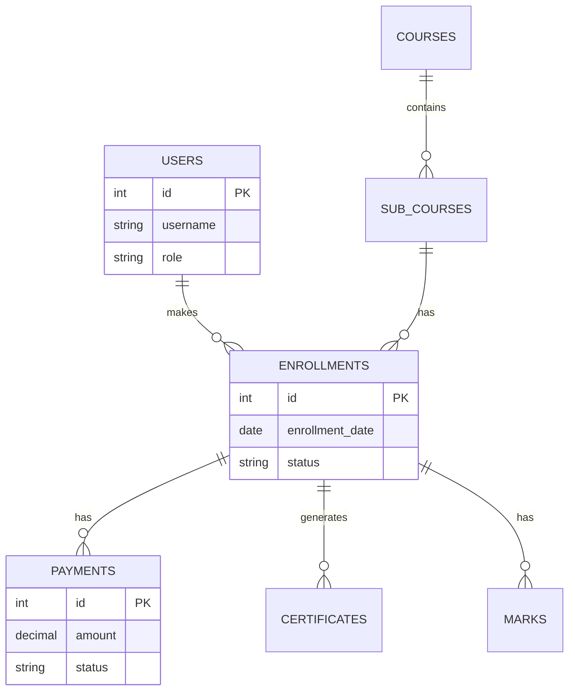

# High-Level Design (HLD) - GICT Institute

## 1. Introduction

### 1.1 Purpose
The purpose of this High-Level Design (HLD) document is to provide a comprehensive architectural overview of the GICT Institute Learning Management System (LMS). It outlines the system's architecture, components, data flow, and technology stack to guide developers, stakeholders, and system administrators.

### 1.2 Scope
This document covers the design of the web-based application for managing institute operations, including:
*   User Management (Student, Faculty, Admin)
*   Course Management
*   Student Enrollment & Payment Tracking
*   Certificate Generation & Verification
*   Content Management (News, Gallery)

### 1.3 Definitions & Acronyms
*   **LMS**: Learning Management System
*   **HLD**: High-Level Design
*   **PRD**: Product Requirements Document
*   **RBAC**: Role-Based Access Control
*   **MVC**: Model-View-Controller (Architectural Pattern)

---

## 2. System Overview

The GICT Institute system is a monolithic web application built using PHP and MySQL. It serves three primary user roles:
1.  **Students**: Browse courses, enroll, track progress, and download certificates.
2.  **Faculty**: Manage courses and view student progress.
3.  **Admins**: Oversee the entire system, approve enrollments, manage payments, and generate certificates.

The system is designed to be responsive, secure, and easy to deploy on standard LAMP/LEMP stacks.

---

## 3. System Architecture

### 3.1 Logical Architecture

The system follows a layered architecture pattern:

```mermaid
graph TD
    subgraph "Presentation Layer"
        A[Web Browser (Desktop/Mobile)]
        B[Public Pages (Home, Courses)]
        C[Secure Portals (Student, Admin)]
    end

    subgraph "Application Layer (PHP)"
        D[Authentication & Session Mgmt]
        E[Course Controller]
        F[Enrollment Controller]
        G[Payment Controller]
        H[Certificate Engine]
        I[File Handler]
    end

    subgraph "Data Layer"
        J[(MySQL Database)]
        K[File Storage (Local/Uploads)]
    end

    subgraph "External Services"
        L[ImgBB API (Image Hosting)]
        M[QR Code Generator Lib]
    end

    A <--> B
    A <--> C
    B --> E
    C --> D
    C --> E
    C --> F
    C --> G
    C --> H
    D --> J
    E --> J
    F --> J
    G --> J
    H --> J
    H --> M
    I --> K
    I --> L
```

### 3.2 Physical Architecture (Deployment)

The application is containerized using Docker but can also run on a standard web server.

```mermaid
graph LR
    Client[Client Device] -->|HTTPS| LB[Load Balancer / Web Server]
    LB -->|FastCGI| App[PHP Application Container]
    App -->|TCP/3306| DB[MySQL Database Container]
    App -->|FS| Vol[Persistent Volume (Uploads)]
```

---

## 4. Component Design

### 4.1 Frontend Components
*   **Public Interface**: `index.php`, `about-gict.php`, `gallery.php`. Uses HTML5, CSS3, and Bootstrap for responsiveness.
*   **Dashboards**:
    *   `dashboard.php`: Central hub that dynamically renders content based on user role (Admin/Student/Faculty).
    *   `profile.php`: User profile management.
*   **Authentication**: `login.php`, `auth.php` handles login, registration, and session initialization.

### 4.2 Backend Modules
*   **User Management**: Handles registration, login, password management, and RBAC.
*   **Course Management**: CRUD operations for Courses and Sub-courses.
*   **Enrollment System**: Manages student course selection and approval workflows.
*   **Payment System**: Tracks payment details, transaction IDs, and verification status.
*   **Certificate Engine**: Generates PDF certificates and marksheets using templates and dynamic data. Integrates with `phpqrcode` for verification.
*   **Content Management**: Manages News/Events and Gallery images.

### 4.3 Database Design

The database schema consists of the following key entities:



*Ref: See `database_schema.sql` for full DDL.*

---

## 5. Key Data Flows

### 5.1 Student Enrollment Flow
1.  **Initiation**: Student selects a course and sub-course.
2.  **Submission**: Fills enrollment form and submits payment details.
3.  **Processing**: System creates `enrollment` record with status `pending`.
4.  **Verification**: Admin reviews payment and approves enrollment.
5.  **Completion**: System updates status to `enrolled`.

### 5.2 Certificate Generation Flow
1.  **Trigger**: Admin marks course as completed and enters marks.
2.  **Generation**: System calculates grade, generates unique Certificate ID.
3.  **QR Code**: QR code is generated containing verification URL.
4.  **Persistence**: Certificate metadata saved to `certificates` table.
5.  **Access**: Student can download Certificate and Marksheet from dashboard.

---

## 6. External Interfaces

*   **ImgBB API**: Used for offloading image storage (e.g., course thumbnails, gallery images) to reduce local storage load.
*   **QR Code Library**: Local PHP library (`phpqrcode`) used to generate verification codes for certificates.

---

## 7. Non-Functional Requirements

### 7.1 Security
*   **Input Validation**: All user inputs are sanitized to prevent SQL Injection and XSS.
*   **Password Hashing**: Passwords are hashed using `password_hash()` (Bcrypt).
*   **Session Security**: Session regeneration on login to prevent fixation.
*   **Access Control**: Strict checking of `$_SESSION['role']` on protected pages.

### 7.2 Performance
*   **Optimization**: Database indexes on frequently queried columns (e.g., `user_id`, `course_id`).
*   **Asset Management**: Minified CSS/JS where possible; external image hosting reduces bandwidth.

### 7.3 Scalability
*   **Statelessness**: Application logic is largely stateless, allowing for horizontal scaling if session storage is centralized (e.g., Redis - *future scope*).
*   **Database**: Designed to support thousands of records; can be migrated to managed SQL services.

---

## 8. Technology Stack

| Component | Technology | Version |
| :--- | :--- | :--- |
| **Frontend** | HTML5, CSS3, JavaScript, Bootstrap | Latest |
| **Backend** | PHP | 7.4+ |
| **Database** | MySQL | 5.7+ |
| **Web Server** | Apache / Nginx | 2.4+ / 1.18+ |
| **OS** | Linux (Ubuntu/Alpine) / Windows | Any |
| **Containerization** | Docker, Docker Compose | Latest |

---

## 9. Future Enhancements
*   **Payment Gateway**: Integration with Stripe/Razorpay for automated payments.
*   **API Layer**: RESTful API for mobile app support.
*   **Email Notifications**: SMTP integration for automated emails.
