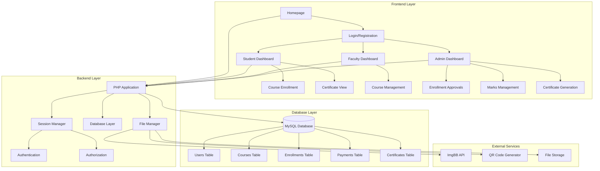
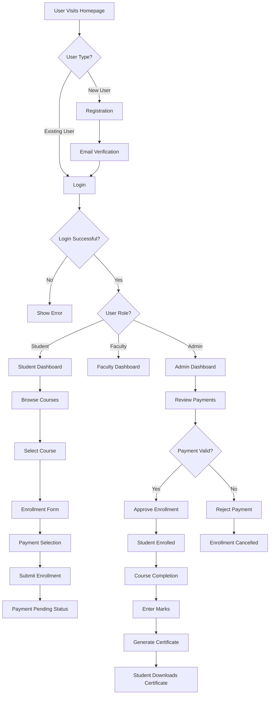
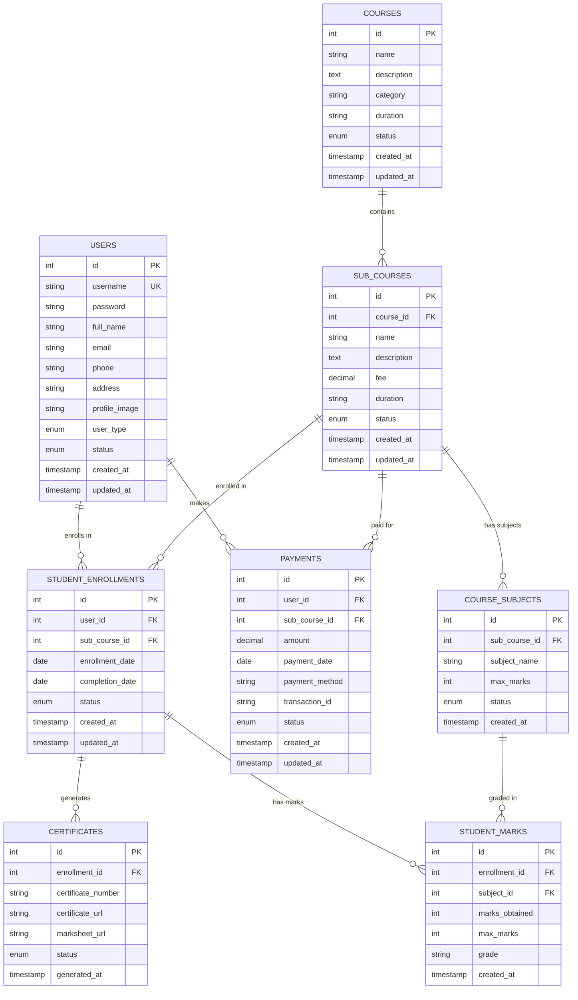
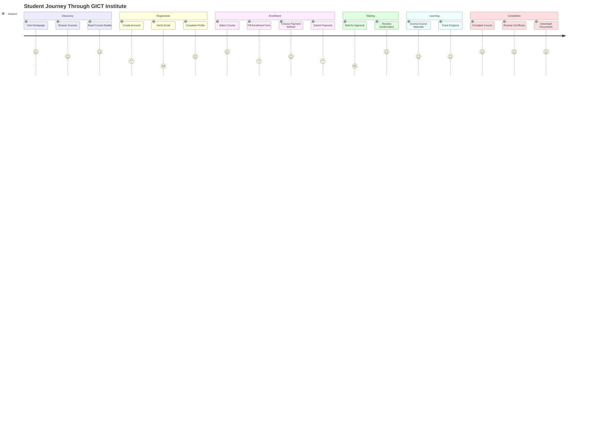
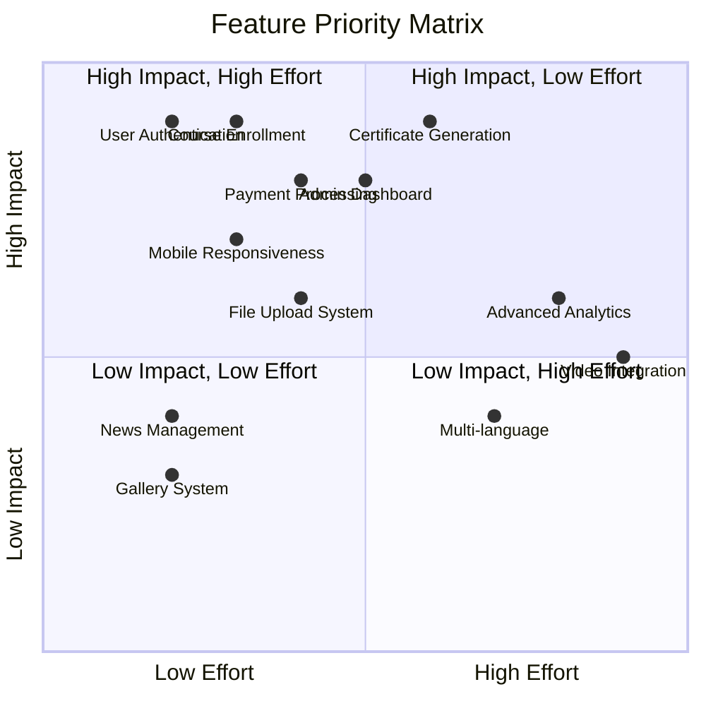
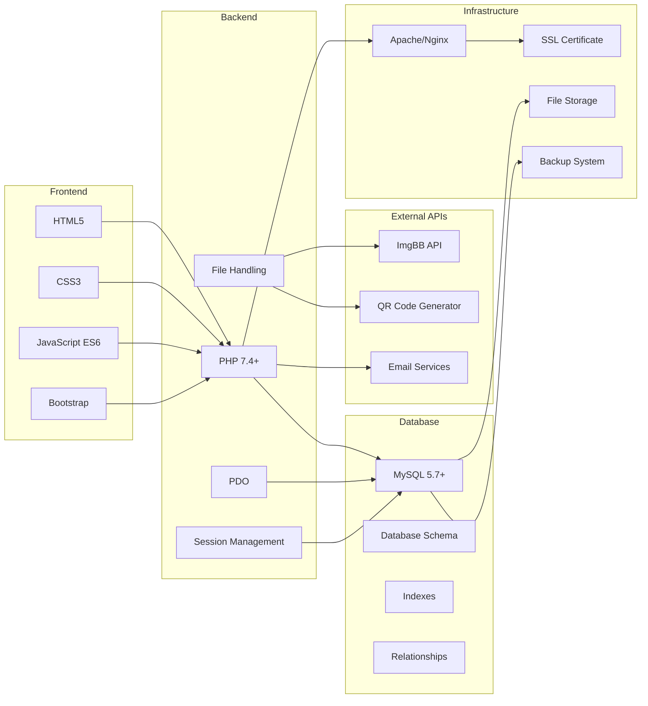
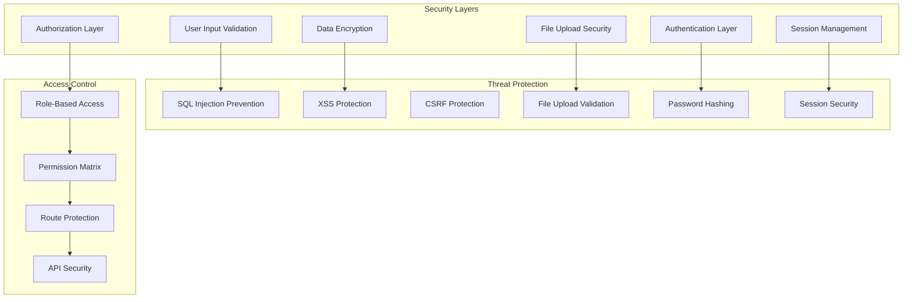

# GICT Institute - System Architecture Visualization

## 1. System Architecture Diagram

## 2. User Flow Diagram

## 3. Database Entity Relationship Diagram

## 4. User Journey Map

## 5. Feature Priority Matrix

## 6. Technology Stack Visualization

## 7. Security Architecture

## How to Use These Visualizations

### 1. **Mermaid Live Editor**
- Visit: https://mermaid.live/
- Copy and paste any of the diagrams above
- Export as PNG, SVG, or PDF

### 2. **VS Code Extension**
- Install "Mermaid Preview" extension
- Create `.md` files with mermaid code blocks
- Preview directly in VS Code

### 3. **GitHub/GitLab**
- These diagrams will render automatically in markdown files
- Perfect for documentation and README files

### 4. **Notion/Obsidian**
- Both support Mermaid diagrams
- Great for project documentation

### 5. **Draw.io/Lucidchart**
- Import the concepts and recreate with more customization
- Professional presentation-ready diagrams

Would you like me to create any specific type of visualization or modify any of these diagrams?
